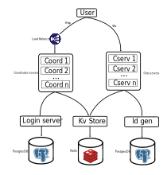

# Scalable Chat System Backend

This is an implementation of the exercise `CHAPTER 12: DESIGN A CHAT SYSTEM` from the book `System Design Interview` by Alex Xu.

The main idea of the task is to design a chat system backend that has the capacity to scale to handle millions of users. To reach that goal, we use a distributed architecture from the beginning of the design. The complex design is only worthwhile in the case where it is used for that number of users.
Not only would the complex design be needed in that case, but also a cloud service to handle the servers and databases would be needed (AWS, Azure, GCP). Kubernetes could also be an option to manage server instances across an arbitrary number of nodes; servers don't need to be physical—they can be pods. In this solution, as a first approach, we have simply containerized the different instances with `docker-compose.yml` in declarative style as we run in a single node, but it could be improved.

## What is made with AI?
AI was used as a guide for debugging (mostly Gemini) and to generate initial code snippets with Claude. However, the implementation of the entire architecture was done manually using these snippets as a starting point. No part of the code is made entirely by AI without review.
Documentation of endpoint descriptions and comments on tests, except for integration tests (which are the most complex and important ones), were made with AI using Copilot and reviewed. Also this README had a grammar check with Copilot.

## Ideal design

The ideal design proposed was made with microservices as follows: a group of stateless coordinator servers interact with users via HTTP. A load balancer distributes the load of users across the different servers interfaced as a service. These servers interact with three other services: a Login service, a KV Store (for messages, connection and subscription information using a cache), and an ID generator (to generate message IDs with a relational database). Login, KV Store, and ID Generator are decoupled from the coordinator and chat servers to ensure they can be scaled further (although we didn't include it directly in this design). We could also add decoupled presence servers to handle user connection and disconnection lifecycles (we also didn't include it) and add end-to-end encryption to messages. Last but not least, we could add a message broker (such as Redis) to handle the message queue between chat servers.

The criteria was to divide responsibility into microservices to allow for a scalable system. This complexity is only worthwhile if the number of users is high enough; otherwise, the maintenance cost would be too high for the return.



## What we included in this design implementation

For this exercise, we simplified the design to be able to complete it in just a few days of work. But it could be easily upgraded if necessary as it is built to be scalable. We used just one coordinator, one chat server, and the login system was mocked as an in-memory database without persistence. We also didn't include persistence servers or group chats. We just made the system capable of allowing connected users to send DMs and subscribe to those DM conversations. A method to request old conversations could be made to handle user synchronization with old messages.


## Implementation details

The implementation is in Python, using Poetry and virtualenvs to handle the dependencies of each service decoupled from each other. We use Flask for the stateless endpoints, and asyncio for concurrency (we avoid blocking while waiting for responses or database writes).

The solution is only a backend, so we rely heavily on tests to verify functionality. We used two kinds of tests: unit tests and integration tests (using pytest). The system could work with any front-end that handles the protocol used in the integration tests.

The modules `kv_store` and `id_generator` have dedicated Python libraries, `kv_store_lib` and `id_generator_lib`, and this way we separated the servers implementation from the database interface implementation. This interface separation allows us to divide the interface with the databases and the server implementation, which could be useful if we needed to implement distributed databases and the service interface could diverge from the database interface. The libraries have unit tests to ensure correct functionality. The `kv_store` and `id_generator` services have no tests, as this is a simple example, but they should. Using libraries for specific functionality that can be used project-wide has the benefit that we can easily downgrade the library version used in the service in case of unexpected upgrade bugs, and we can also experiment with the library without needing to upgrade it in the main project right away.

The rest of the solution consists of a `coordinator` and a `chat_server`. The coordinator has tests for the stateless part of the functionality; the `chat_server` and `coordinator` interaction over user usage are tested with integration tests.

### Data model

### KV Store

Redis-based key-value store with the following data structures used by the chat server:

**User Server Registration:**
```
Key: userver>$user_id>$session_token:100
Value: $server_id
```
Tracks which chat server a connected user is registered to.

**User Subscriptions:**
```
Key: usubscription>$message_group_name>$server_id>$user_id>$session_token:100
Value: 'true'
```
Tracks user subscriptions to message groups on a specific server.

**Direct Messages:**
```
Key: dm_message>$message_group_name>$message_number:100
Value: $message_content
```
Stores direct message content. Message group format: `dm<$min_user_id><$max_user_id>`

### ID Generator

PostgreSQL table for tracking message group counters:

```sql
CREATE TABLE message_groups (
    message_group_name VARCHAR PRIMARY KEY,
    counter INTEGER NOT NULL,
    created_at TIMESTAMP WITH TIME ZONE,
    updated_at TIMESTAMP WITH TIME ZONE
)
```

Stores sequential ID counters for each message group. Primary Key is message_group_name to ensure there can't be duplicate chat groups. Transaction management of the ID generator guarantees the uniqueness of IDs.

## Project structure

We have all code in the `src` folder. There is one folder for each service (`chat_server`, `coordinator`, `id_generator`, `kv_store`), plus an integrated tests folder (which verifies the interaction between clients and the services).
All other unit tests are in the `test` folder of each service/library. Each service/library has a `pyproject.toml` and `poetry.lock` with library requirements and exact library versions used. `Dist` folders contain the compiled library versions. When a library is compiled, that file must be copied from the `libs` folder with the source code to the service folder that uses the library (in its `dist` folder).

```
/src
├── integrated_tests/
├── chat_server/
│   ├── pyproject.toml
│   ├── poetry.lock
│   ├── chat_server.py # Main file
│   ├── Dockerfile
│   └── utils/
├── coordinator/
│   ├── pyproject.toml
│   ├── poetry.lock
│   ├── coordinator.py # Main file
│   ├── Dockerfile
│   ├── tests/
│   ├── routes/
│   └── utils/
├── id_generator/
│    ├── pyproject.toml
│    ├── poetry.lock
│    ├── id_generator.py # Main file
│    ├── Dockerfile
│    ├── routes/
│    └── dist/ # Compiled ID generator lib for the service
├── kv_store/
│    ├── pyproject.toml
│    ├── poetry.lock
│    ├── kv_store.py # Main file
│    ├── Dockerfile
│    ├── routes/
│    └── dist/ # Compiled KV Store lib for the service
├── libs/ # Project libraries used in dependencies
│    └── kv_store_lib/
│        ├── pyproject.toml
│        ├── poetry.lock
│        ├── kv_store_lib.py # Main file
│        ├── tests/
│        └── dist/
│    └── id_generator_lib/
│        ├── pyproject.toml
│        ├── poetry.lock
│        ├── id_generator_lib/ # Main lib module folder (Main file: __init__.py)
│        │   └── __init__.py
│        ├── tests/
│        └── dist/
├── docs/
├── docker-compose.yml # Docker compose for PostgreSQL, Redis database, KV Store and ID Generator services
└── docker-compose_just_db.yml # Docker compose for PostgreSQL and Redis databases only
```

## Installation with Docker
The containerized version is perfect for a production environment (as its descriptive design makes it easy to handle infrastructure versioning and details) and could be further upgraded to multiple nodes using Kubernetes (which would also bring redundancy and scalability).
To build the Docker images and run them in containers, you need to install Docker. Execute Docker Compose and then verify integration tests over the system. You need to have Poetry installed to test the modules separately in virtualenvs. It is recommended to also have pyenv so you can easily manage different installations of Python versions. You can run it on Ubuntu, Windows with WSL, or just PowerShell. It is tested with Windows with WSL.

```
docker compose up
```
This starts all project services. Verify the backend with integration tests (with Poetry):

```bash
source .venv/bin/activate
poetry lock
poetry install
pytest tests/test_messages.py -o log_cli=true --log-cli-level=INFO
```

If the tests run correctly, you should see '4 passed'.

## Complete module installation

To run project modules separately in virtualenvs (and to run unit tests), you need to execute these scripts in order.

Important: Change `.env_example` files to `.env` before starting. There are three: `src/id_generator/.env_example`, `src/libs/id_generator_lib/.env_example`, and `.env_example`. Also, if you run services without Docker, you need to bring up the database using `docker-compose_just_db.yml`. Rename it to `docker-compose.yml` (replace the full Docker Compose) and run `docker compose up`.

### ID Generator
```bash
cd src/id_generator
python -m venv .venv
poetry lock
poetry install
start_id_generator localhost
```

### KV Store
```bash
python -m venv .venv
source .venv/bin/activate
poetry lock
poetry install
start_kv_store localhost
```

### Coordinator
```bash
python -m venv .venv
source .venv/bin/activate
poetry lock
poetry install
start_coordinator localhost
```

### Chat Server
```bash
python -m venv .venv
source .venv/bin/activate
poetry lock
poetry install
start_chat_server 0 localhost localhost
```

## Build libraries
Note: increase version number when upgrading the lib. (TODO: Handle lib versioning in a different repo).
Compiled libraries are already added to the services in the repo; this is only needed to compile a new lib version.

### KV Store Lib
```bash
cd src/libs/kv_store_lib
python -m venv .venv
source .venv/bin/activate
poetry lock
poetry build
cd ../../..
mv src/libs/kv_store_lib/dist/* src/kv_store/dist
```

### ID Generator Lib
```bash
cd src/libs/id_generator_lib
python -m venv .venv
source .venv/bin/activate
poetry lock
poetry build
cd ../../..
mv src/libs/id_generator_lib/dist/* src/id_generator/dist
```

## Run tests

### Integration tests
These tests are important to verify the functionality of the whole system. We add '-o log_cli=true --log-cli-level=INFO' to enable logging for further test debugging. The tests are made by incrementing the usage of the system in each one. This test-driven development is perfect for designing the system decoupled from the front-end (which is not included in this project).

```bash
cd src/integrated_tests
source .venv/bin/activate
poetry lock
poetry install
pytest tests/test_messages.py -o log_cli=true --log-cli-level=INFO
```
Note: registration may fail if a user is already registered, but it has no effect and does not make the test fail. TODO: Clean to make no registration if not needed, or delete user after tests are finished.

Integration tests that are used:

- test_connect_and_disconnect
- test_subscribe_to_conversation
- test_send_direct_message
- test_send_peer_message

### Unit tests
These tests verify the functionality of each module.

#### KV Store Lib
To run tests of KV Store Lib, you need to run the Redis DB Docker Compose separately. There is a `docker-compose.yml` in the folder.

```bash
cd src/libs/kv_store_lib
source .venv/bin/activate
pytest tests/test_kv_store.py -o log_cli=true --log-cli-level=INFO
```

#### ID Generator Lib
To run tests of ID Generator Lib, you need to run the PostgreSQL DB Docker Compose separately. There is a `docker-compose.yml` in the folder.

```bash
cd src/libs/id_generator_lib
source .venv/bin/activate
pytest tests/test_id_generator.py -o log_cli=true --log-cli-level=INFO
```

#### Coordinator
To run tests of the coordinator, you need to run the Redis DB Docker Compose separately. There is a `docker-compose.yml` in the folder. Important: to run successfully the test that attempts a chat server connection 'test_server_connection', you need to run the chat server.

```bash
cd src/coordinator
source .venv/bin/activate
pytest tests/test_coordinator.py -o log_cli=true --log-cli-level=INFO
```

### Test List

The project currently includes the following test cases:

- `src/integrated_tests/tests/test_messages.py`
  - `test_connect_and_disconnect`
  - `test_subscribe_to_conversation`
  - `test_send_direct_message`
  - `test_send_peer_message`

- `src/coordinator/tests/test_coordinator.py`
  - `test_register`
  - `test_login`
  - `test_register_three_users_and_check_existence`
  - `test_join_server`
  - `test_server_connection`

- `src/libs/id_generator_lib/tests/test_id_generator.py`
  - `test_generate_single_id`
  - `test_increment_id`

- `src/libs/kv_store_lib/tests/test_kv_store.py`
  - `test_save_and_read`
  - `test_replace_stored_value`
  - `test_two_keys`
  - `test_create_and_delete_key`
  - `test_query_prefix`
  - `test_query_delete_with_suffix`
  - `test_query_delete_with_prefix_and_suffix`

## Pre-commit hooks

The project uses pre-commit hooks to ensure code quality. The file `pre-commit-config.yaml` has the configuration (currently Black, Ruff, and isort are activated).

## Observability

This is a test to run observability with OpenTelemetry in the coordinator module to check traces, metrics, and logs. We just sent the data to the console as it was a simple test. This observability information could be sent to another system to be properly monitored.

```bash
cd src/coordinator
source .venv/bin/activate
opentelemetry-bootstrap -a install
opentelemetry-instrument opentelemetry-instrument --traces_exporter console --metrics_exporter console --logs_exporter console start_coordinator localhost
```

## Features that could be implemented as upgrades to this project

- End-to-end encryption of messages
- Group messages
- Multiple chat servers
- Decoupled and persistent login system from coordinator
- User presence servers (to verify user connection using heartbeats)
- A user lifecycle watchdog to clean periodically the KV Store database registers in case users leave irresponsibly
