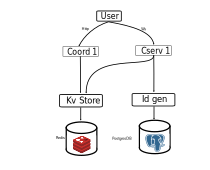

# Scalable Chat System Backend

This is an implementation for the excercise "CHAPTER 12: DESIGN A CHAT SYSTEM
" from the book System Design Interview from Alex Xu. T

The main idea of the task is to design a chat system backend that has the capacity of scale to handle millon of users. To reach that goal we use a distributed architecture from the begining of the design. The complex design is only worth in the case is used for that amount of users. 
Not only the complex design would be need in that case but also a cloud service to handle the servers and databases would be needed (AWS, Azure, GCP). Kubernetes could also be an option to manage the server instances in an aritrary amount of nodes, servers don't need to be physical can be containers. In this solution, as a first approach we just containerized the different instances with docker-compose.yml declarative style as we run in a single node, but it could be improved.

## Ideal design

The ideal design proposed was made with microservices as the following: a group of stateless coordinator servers interact with the users with HTTP. A load balancer distributes the load of users over the different servers interfaced as a service. This servers interact with other three services, a Login, a KV Store (For messages, connection and subscription information using a cache) and an Id generator (To generate messages ids with a relational database). Login, KV Store and Id Generator are decoupled from coordinator and chat servers, to ensure they could be scaled further (Althogh we didn't include it directly in this designu). Also we could also add deacoupled presence servers to handle users connection and disconnection lifecylces (We also didn't include it). Last but not least, we could add a message broker (such as redis) to handle the message queue between chat servers.

The criteria was so to divide the responsability in microservices to allow a scalable system. This complexity is only worth if the number of users is high enough otherwise the maintenance cost would be too high for the return.


## What we included in this design implementation

For this excercise we simplified the design to be able to complete it in just days of work. But the design could be easily upgraded if necesary as it is build with the scalable design from the begining. We used just one coordinator, just one chat server, and the login system was mocked as a memory database without persistence. Also we didn't include persistence servers or group chats. We just made the system to be able for connected users to send DMs and subscribe to that DMs conversations. A method to ask for old conversations could be easily made to handle user syncronization with old messages.



## Implementation Details

The implementation is with python, using poetry and virtualenvs to handle the dependencies of each service deacoupled from each other. We use flask for the statless endpoints.

The solution is just a backend, so we rely heavily on tests to verify the functionality. We used two kind of tests, unity tests and integration tests (Using pytest). The system could work with any front end that handle the protocol used in the integration tests. 

For ease of deployment we added containerization for KV Store and Id Generator. This modules also had dedicated python libraries, kv_store_lib and id_generator_lib and this we we separated the servers implementation from the library interface. This interface separation allows us to divide the interface with the service and the server implementation, which could be useful if we would need to implement distributed databases and service interface could diverge with the database interface. The libraries have unity tests to ensure correct functionality. The kv_store and id_generator have no tests as this is a simple example but it should have.

The rest of the solution is a Coordinator and a Chat Server. (TODO: Add containerization for these services too). The coordinator has tests for the stateless part of its function, the Chat Server and Coordinator interaction over users usage are tested with integration tests. 

## Proyect structure


## TODO: Limpiar readme

```
project/
├── app.py
├── requirements.txt
├── routes/
│   ├── __init__.py
│   ├── auth.py          # Login y registro
│   └── protected.py     # Rutas protegidas con JWT
└── utils/
    ├── __init__.py
    └── jwt_helper.py    # Generación y validación de tokens
```

## Instalación

```bash
pip install -r requirements.txt
```

## Ejecutar el servidor

```bash
python app.py
```

## Endpoints

### Públicos

| Método | Ruta             | Descripción         |
|--------|------------------|---------------------|
| GET    | `/`              | Health check        |
| POST   | `/auth/register` | Registrar usuario   |
| POST   | `/auth/login`    | Login → devuelve token |

### Protegidos (requieren `Authorization: Bearer <token>`)

| Método | Ruta          | Descripción              |
|--------|---------------|--------------------------|
| GET    | `/api/perfil` | Retorna datos del usuario |

## Ejemplo de uso

### Registrar usuario
```bash
curl -X POST http://localhost:5000/auth/register \
  -H "Content-Type: application/json" \
  -d '{"email": "user@example.com", "password": "1234"}'
```

### Login
```bash
curl -X POST http://localhost:5000/auth/login \
  -H "Content-Type: application/json" \
  -d '{"email": "user@example.com", "password": "1234"}'
```

### Usar ruta protegida
```bash
curl http://localhost:5000/api/perfil \
  -H "Authorization: Bearer <tu_token>"
```

## Kv Store library install

Build kv store library and copy to kv store service folder 

poetry build -P src/libs/kv_store_lib
mv src/libs/kv_store_lib/dist/* src/kv_store/dist
rm -d src/libs/kv_store_lib/dist

## Run KV Store

cd src/kv_store
python -m venv .venv
source .venv/bin/activate
poetry install
start_kv_store

## Id generator library install
cd src/libs/id_generator_lib
python -m venv .venv
source .venv/bin/activate
poetry build
cd ../../..
mv src/libs/id_generator_lib/dist/* src/id_generator/dist

## Run Id generator
cd src/id_generator
python -m venv .venv
poetry install
run_id_generator

## Run Coordinator instance
python -m venv .venv
source .venv/bin/activate
poetry install
start_coordinator

## Run tests with info logs enabled
pytest tests -o log_cli=true --log-cli-level=INFO
## Logs command

pytest tests/test_messages.py::test_send_direct_message -o log_cli=true --log-cli-level=INFO